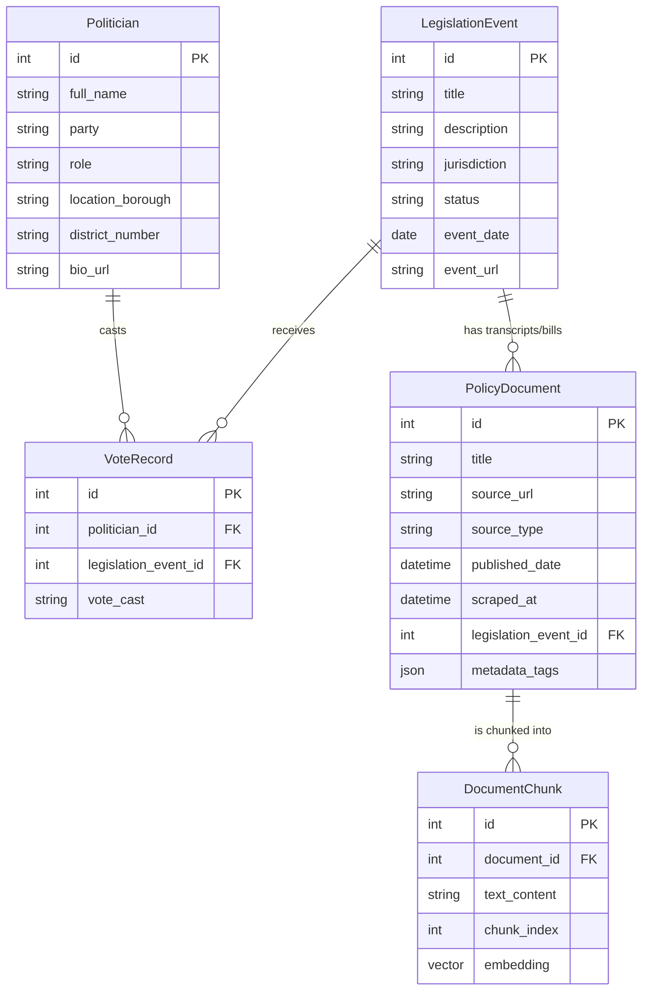

# Database Architecture 
The central pillar of Civic Spiegel is the ability to securely and seamlessly map politicians, policies, and semantic context together without a fragmented backend infrastructure.

---

## ‼️ Pending Setup Actions
> **Note:** All of these are blockers for the MVP.

| Action | Role | Blocker? |
|--------|-------|----------|
| Create Neon Postgres account (free) | BE | ‼️ Yes  blocks all DB tasks |
| Add `DATABASE_URL` to `.env` | BE | ‼️ Yes |
| Run `init_db.py` to create tables | BE | ‼️ After `DATABASE_URL` |
| Create Groq account + API key | BE | ‼️ Blocks real LLM responses |
| Add `GROQ_API_KEY` to `.env` | BE | ‼️ After Groq account |

---

## Neon Serverless Postgres + pgvector
We elected to use a Neon Postgres database instead of a dedicated NoSQL document store (like MongoDB) or a dedicated vector store (like Pinecone/Chroma). 
*   **Reason:** Using the `pgvector` Postgres extension allows us to maintain the strict referential integrity of standard SQL (eg., tying `Politician` IDs to `VoteRecord` IDs), while simultaneously storing 384-dimension vector embeddings alongside the text data in the exact same schema. 
*   Neon's free tier requires no credit card, which aligns with our $0 budget constraint.

> **Status:** Neon account not yet created. The pipeline currently outputs to local JSON files (`pipeline/output/`) as a temporary substitute. All schema code in `backend/schema.py` is ready - only a `DATABASE_URL` connection string is needed to activate it.

## The Schema (SQLModel)
Our schema is fully defined in Python using `SQLModel` in `backend/schema.py`. SQLModel combines Pydantic data validation with SQLAlchemy ORM, meaning API endpoints get automatic type checking for free.

### 5-Table Ecosystem

1. **`Politician`** - Name, party affiliation, role (eg., "Council Member"), borough/district, bio URL.
2. **`LegislationEvent`** - Core tracking unit for bills or acts (eg., "Intro 42-A", "Passage of Bill 123", "Vote on S.1234", etc). Stores jurisdiction, status, date, and event URL.
3. **`VoteRecord`** - Join table linking a `Politician` to a `LegislationEvent` with `vote_cast` ("Yea", "Nay", "Abstain", "Absent"). Note: Naive vote mapping is limited/nuanced - we use RAG context to explain *why* votes happened (eg. "Why did Council Member X vote Nay on Bill Y?")
4. **`PolicyDocument`** - Represents a scraped source (eg., committee minutes, news article, press release). Contains `source_type`, `published_date`, `scraped_at`, and a `metadata_tags` JSON field for ML classification output (policy area, affected demographics).
5. **`DocumentChunk`** - The RAG backbone. Each `PolicyDocument` is split into 500-word chunks. Each chunk stores its `text_content` and a 384-dimension `embedding` vector (generated by FastEmbed's `BAAI/bge-small-en-v1.5` model).

## MVP Offline Bypass (Active)
Because Neon is not yet provisioned, the pipeline uses a local JSON fallback:
1. Each scraper calls `self.save_to_json(data, filename)` (defined in `BaseScraper`)
2. Output is written to `pipeline/output/<filename>.json`
3. `backend/main.py`'s `get_mock_db_context()` reads this JSON at request time, flattening chunks for the LLM

**Migration path:** Once `DATABASE_URL` is set, replace `save_to_json()` calls with a new `save_to_postgres()` method, and replace `get_mock_db_context()` with a `pgvector` cosine similarity search.

## Visualizing the Schema

