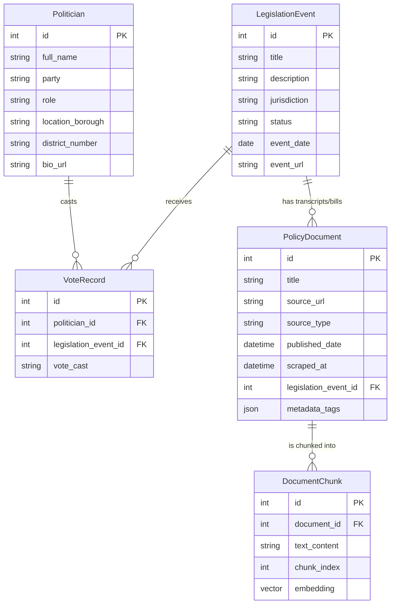

# Database Architecture 
The central pillar of Civic Spiegel is the ability to securely and seamlessly map politicians, policies, and semantic context together without a fragmented backend infrastructure.

---
## Deployment Status
-   **Platform:** Neon Serverless Postgres
-   **Extension:** `pgvector` enabled and active
-   **Status:** **[ACTIVE]** Tables initialized and accepting data via the pipeline.

We elected to use a Neon Postgres database instead of a dedicated NoSQL document store (like MongoDB) or a dedicated vector store (like Pinecone/Chroma). 
-   **Reason:** Using the `pgvector` Postgres extension allows us to maintain the strict referential integrity of standard SQL (eg., tying `Politician` IDs to `VoteRecord` IDs), while simultaneously storing 384-dimension vector embeddings alongside the text data in the exact same schema. 
-   Neon's free tier requires no credit card, which aligns with our $0 budget constraint.

## Database Initialization
To initialize or reset the production database schema, use the `init_db.py` script provided in the `/backend` directory. This script will create all tables defined in `schema.py` and ensure the `pgvector` extension is enabled.

```bash
cd backend
# Ensure DATABASE_URL is in .env
python init_db.py
```

## The Schema (SQLModel)
Our schema is fully defined in Python using `SQLModel` in `backend/schema.py`. SQLModel combines Pydantic data validation with SQLAlchemy ORM, meaning API endpoints get automatic type checking for free.

### 5-Table Ecosystem

1. **`Politician`** - Name, party affiliation, role (eg., "Council Member"), borough/district, bio URL.
2. **`LegislationEvent`** - Core tracking unit for bills or acts (eg., "Intro 42-A", "Passage of Bill 123", "Vote on S.1234", etc). Stores jurisdiction, status, date, and event URL.
3. **`VoteRecord`** - Join table linking a `Politician` to a `LegislationEvent` with `vote_cast` ("Yea", "Nay", "Abstain", "Absent"). Note: Naive vote mapping is limited/nuanced - we use RAG context to explain *why* votes happened (eg. "Why did Council Member X vote Nay on Bill Y?")
4. **`PolicyDocument`** - Represents a scraped source (eg., committee minutes, news article, press release). Contains `source_type`, `published_date`, `scraped_at`, and a `metadata_tags` JSON field for ML classification output (policy area, affected demographics).
5. **`DocumentChunk`** - The RAG backbone. Each `PolicyDocument` is split into chunks (sentence-aware with overlap). Each chunk stores its `text_content` and a 384-dimension **`halfvec` (16-bit)** vector. By using 16-bit precision, we save **50% storage space**, enabling several years of historical data to fit within the Neon free tier.

### High-Density Optimization
Our storage strategy shifts from "Ingest All" to "Intelligence-First":
1. **AI Summarization**: Long documents are condensed into high-signal briefings via Groq/Llama 3.1.
2. **Half-Precision Vectors**: `halfvec` storage ensures we use the minimum bytes per dimension without sacrificing semantic accuracy.
3. **Signal Filtering**: Procedural noise is discarded during ingestion to prioritize policy context.


## Visualizing the Schema


